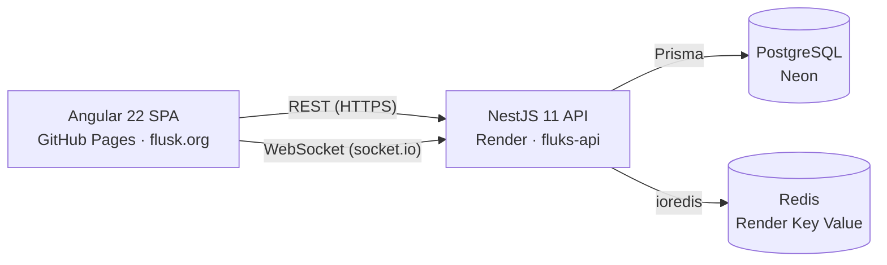

# Fluks

**Watch together, perfectly in sync.** Fluks lets you create a room, share a link, and watch online videos simultaneously with friends — with synchronized playback, a shared playlist, and live chat.

**Live:** [https://flusk.org](https://flusk.org)

## Features

- **Rooms** — create public or private rooms, join by link
- **Synchronized playback** — play, pause, and seek are mirrored to every viewer in real time
- **Shared playlist** — the room admin curates a queue of videos; optional "guest control" lets viewers drive playback too
- **Live chat** — talk while you watch
- **Accounts & profiles** — JWT-based auth with access/refresh tokens, editable profile with nickname
- **Guest access** — a shared room link works without registration: visitors get a readable throwaway identity (e.g. `bright-otter-42`) and can watch and chat right away
- **Light / dark theme** — follows system preference, with a manual toggle in the header

## Architecture



- **PostgreSQL** stores durable data: users, rooms, settings.
- **Redis** holds live room state: playback position, playlist, chat, viewer counts.
- All room events (join/leave, playback, playlist, chat) flow over a JWT-authenticated socket.io connection.

## Repository structure

```
fluks/
├── frontend/   # Angular 22 SPA (standalone components, signals, SCSS design tokens)
├── backend/    # NestJS 11 API (Prisma, Redis, JWT auth, socket.io gateway)
├── docs/       # Deployment guide
└── .github/    # CI (lint + tests) and GitHub Pages deploy
```

## Tech stack

| Layer | Tech |
|---|---|
| Frontend | Angular 22, RxJS, socket.io-client, Vitest, SCSS custom-property theming |
| Backend | NestJS 11, Prisma 5, PostgreSQL, Redis (ioredis), socket.io, JWT, Jest |
| Infra | GitHub Pages + custom domain, Render (Docker), Neon Postgres, GitHub Actions |

## Local development

Prerequisites: Node.js ≥ 22, Docker.

```bash
# 1. Backend + Postgres + Redis (http://localhost:4000)
cd backend
cp .env.example .env
docker compose up -d --build

# 2. Frontend (http://localhost:4200)
cd ../frontend
npm ci
npm start
```

The dev frontend expects the API on `http://localhost:3000` (see `frontend/src/environments/environment.ts`); either set `PORT=3000` in `backend/.env` or adjust the environment file.

Run tests:

```bash
cd frontend && npm test     # Vitest
cd backend  && npm test     # Jest
```

## Deployment

See [docs/DEPLOYMENT.md](docs/DEPLOYMENT.md) — GitHub Pages (frontend), Render Blueprint (backend + Redis), Neon (Postgres), DNS setup for flusk.org.

Planned work lives in [docs/ROADMAP.md](docs/ROADMAP.md) (guest access, more video sources, PWA — see [docs/PWA.md](docs/PWA.md)).

## Acknowledgements

Partially based on a team training project (RS School Angular course, Q2 2026); this repository is an independently maintained continuation.
